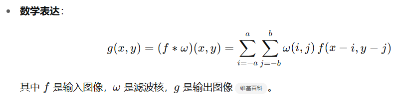
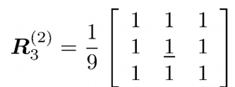
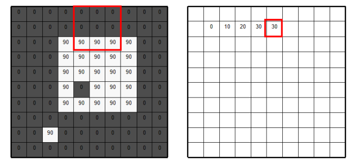

# 1、滤波的基本概念

在计算机视觉中，“滤波”（filtering）指的是利用一定的算子（通常称为“滤波器”或“核”），对图像或点云中的每个位置及其邻域进行加权运算，以突出或抑制特定特征。

**常见操作**：

- 平滑（去噪）：使用均值滤波、Gaussian 滤波等低通滤波器；其中高斯滤波指的是滤波核满足高斯函数，以滤波核中心为(0,0),1为单位距离计算其它点的坐标，然后代入高斯公式计算数值后归一化。关键参数是sigma，这个值越高，中心像素与边缘像素的权重之差就越小，得到的滤波核更接近于均值滤波核，滤波结果更平滑。
- 锐化：增强边缘、提升对比度，使用拉普拉斯、高通滤波器；
- 边缘检测：Sobel、Prewitt、Canny 等算子，均可视为特定的线性滤波器。
