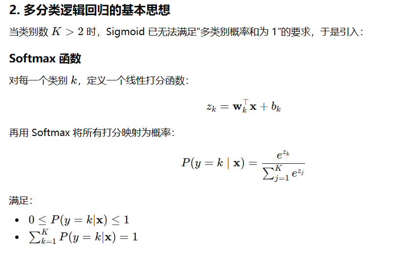

# 1、softmax

softmax是**将一系列数值映射到概率**的操作，具体公式是：

对于**x**=[x_1,x_2....x_n]

SoftMax(x_i)=$\frac{e^{x_i}}{\sum_j{e^{x_j}}} $​

这样：

- 结果输出满足0<p_i<1
- $\sum{p_i}$=1
- 指数函数放大差异

此外，为了避免数值溢出，标准做法是计算SoftMax(x_i-x_max)。

另一方面，输出满足：$\log{\frac{P(y=i)}{P(y=j)}}=x_i-x_j$

为什么不直接均值归一化？

- 无法处理有负数的情况
- 梯度计算复杂

# 2. 多分类逻辑回归的基本思想

